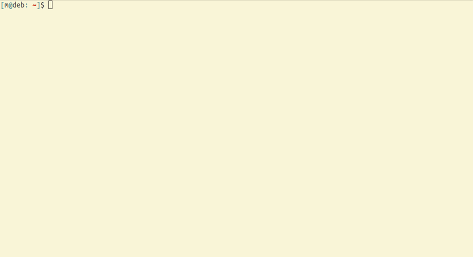

# Create Odoo Module

Set up an Odoo module by running one command with predefined templates and variables.

Create Odoo Module is written in POSIX compliant shell with minimal dependencies to work on Linux, BSD and macOS.

## Getting Started

### Installation

To install `create-odoo-module` simply clone the repository and make sure the script `create-odoo-module` is in $PATH. This can be achieved for example by using a symlink to `/usr/local/bin`.

```sh
git clone https://github.com/miikanissi/create-odoo-module.git
cd create-odoo-module
ln -sr create-odoo-module /usr/local/bin
```

Create Odoo Module requires no additional dependencies on top of GNU Core Utilities or other similar utilities on macOS and BSD.

### Set Up

Values used by `create-odoo-module` can be defined in a `.create-odoo-modulerc` file located in the base directory where the program is run. If no `.create-odoo-modulerc` file exists, the default values from the program directory `.create-odoo-modulerc.defaults` file will be used.

The following variables can be set in the `.create-odoo-modulerc` file:

| Variable                | Description                                                   |
| ---                     | ---                                                           |
| NAME                    | Name of the module                                            |
| VERSION                 | Version number of the module                                  |
| CATEGORY                | Category of the module                                        |
| SUMMARY                 | Short one line summary of the module                          |
| WEBSITE                 | Website of the module author or repository                    |
| AUTHOR                  | Author of the module                                          |
| LICENSE                 | License used for the module                                   |
| DEPENDS                 | Comma-separated list of other Odoo module dependencies        |
| DATA                    | Comma-separated list of data files for the module             |


#### Example `.create-odoo-modulerc` File

```sh
NAME=Module
VERSION=1.0
CATEGORY=
SUMMARY=
WEBSITE=
AUTHOR=
LICENSE=LGPL-3
DEPENDS=
DATA=
```

### Creating a Module

To create a new module, use the following command:

```sh
create-odoo-module my_module
```

It will prompt for the user defined variables. To keep the default value for a variable, you may press the return key.

<p align='center'>
  
</p>

After completing the prompts, it will create a directory called `my_module` inside the current folder.
Inside that directory, it will generate the module structure using the defined values:

```sh
my_module
├── data
│   └── ir_cron.xml
├── __init__.py
├── __manifest__.py
├── static
│   └── description
│       └── icon.png
└── views
    ├── res_config_settings.xml
    └── templates.xml

4 directories, 6 files
```

The `__manifest__.py` file is also generated using the defined values:

```python
{
    "name": "My Module",
    "version": "15.0.1.0.0",
    "category": "Website",
    "summary": "This is My Module",
    "website": "https://github.com/miikanissi/create-odoo-module",
    "author": "Miika Nissi",
    "license": "LGPL-3",
    "application": False,
    "installable": True,
    "depends": ["website", "website_sale"],
    "data": ["data/ir_cron.xml", "views/res_config_settings.xml", "views/templates.xml"],
}
```

## License

Create Odoo Module is free software [licensed as LGPL-3](./LICENSE).
